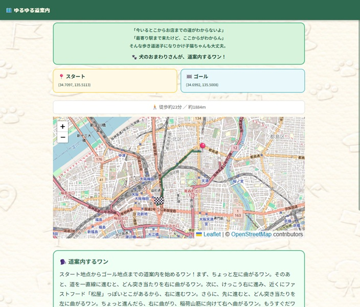

# 🐾 ゆるゆる道案内

> 犬のおまわりさんが、ゆる〜く道案内するワン。

[](https://yuruyuru-navi.streamlit.app/)



---

## 📋 アプリ概要

童謡「犬のおまわりさん」をモチーフにした、ゆるい徒歩道案内アプリです。

スタートとゴールを地図タップ・テキスト検索・GPS で設定するだけで、一生懸命だけどちょっとおせっかいな犬のおまわりさんが、道案内のセリフを生成してくれます。正式な店名は使わず「〇〇っぽいとこの角」「〇〇みたいなとこの横」のようにふわっと案内するのがポイントです。モバイル対応済みなので、外出先でもサクッと使えます。

**🔗 デモ：https://yuruyuru-navi.streamlit.app/**

---

## ✨ 主な機能

| 機能 | 説明 |
|------|------|
| 🗺️ ルート取得 | OpenRouteService API で徒歩ルートを取得 |
| 🐾 道案内セリフ | 曲がり角情報＋ランドマークをもとに Groq AI がゆるいセリフを生成 |
| 🌤️ おせっかいセリフ | 天気・気温・花粉情報をもとに出発前アドバイスを生成 |
| 📍 3種類の地点入力 | 地図タップ / テキスト検索（Nominatim）/ GPS（現在地） |
| 🔀 スタート・ゴール入れ替え | ワンタップで往路・復路を切り替え |
| 🗺️ Google Maps 連携 | 迷ったときは Google Map 先生に引き継げる |

---

## 🖥️ 画面構成

```
【1ページ目：スタート・ゴール入力】
スタート地点を設定（GPS / テキスト検索 / 地図タップ）
　＋
ゴール地点を設定（テキスト検索 / 地図タップ）
　↓
「🔍 ルートを検索する」ボタン（両方確定後に活性）
　↓ ORS でルート取得

【2ページ目：ルート確認・道案内】
ルート表示（地図 ＋ 徒歩○分 ／ 約○m）
　↓ Overpass・天気をバックグラウンド取得中…
「案内してもらうワン🐾」ボタンが出現
　↓ Groq でセリフ生成（並行）
道案内セリフ ＋ おせっかいセリフ 表示
　↓
もう一回道案内 / Google Map に引き継ぐ / 最初からやり直す
```

---

## 🐕 キャラクター設定

- 語尾に「〜ワン」をつける
- お店・建物名はうろ覚えで、ぼんやりした表現のみ（正式名称は使わない）
- ランドマーク情報は「〇〇っぽいとこの角」「〇〇みたいなとこの横」のように使う
- 交差点名はそのまま使ってよい（例：「〇〇交差点あたりで左に曲がるワン」）
- 距離感は「ちょっと」「けっこう」「すぐそこ」など感覚的に
- 一生懸命・おせっかい・寄り添い型のキャラクター

---

## 🛠️ 技術スタック

| 要素 | 内容 |
|------|------|
| フレームワーク | [Streamlit](https://streamlit.io/) |
| 地図 | streamlit-folium（Leaflet相当・クリックで座標取得可） |
| ルート取得 | [OpenRouteService](https://openrouteservice.org/) API |
| ランドマーク取得 | [Overpass API](https://overpass-api.de/)（3サーバーフォールバック） |
| 天気取得 | [OpenWeatherMap](https://openweathermap.org/) API |
| AI セリフ生成 | [Groq API](https://groq.com/)（llama-3.3-70b-versatile） |
| GPS | streamlit-js-eval |
| 言語 | Python 3.13 |
| デプロイ | Streamlit Community Cloud |

---

## 💡 工夫したポイント

### AI プロンプト設計
- 曲がり角情報に「重要 / 省略可」「どん突き当たり」などのラベルを付与してから Groq に渡すことで、自然な案内文を生成
- 道案内セリフとおせっかいセリフを **ThreadPoolExecutor で並行呼び出し** して待ち時間を短縮
- ランドマーク名は正式名称をそのまま渡さず、「〇〇っぽいとこ」に変換するよう指示してキャラクターとのズレを防止

### ランドマーク取得
- Overpass API は3サーバーのフォールバック構成（全滅時はランドマークなしで続行）
- 小型店舗は曲がり角から15m以内、大型施設（駅・病院等）は35m以内で距離フィルタ
- 大型施設を優先ソートし、曲がり角1箇所につき最大2件に絞ることで情報過多を防止

### UI / UX
- **3種類の地点入力**：地図タップ / テキスト検索 / GPS を組み合わせて使える
- **GPS one-shot 制御**：`ss.gps_requested` フラグで「ボタン押下 → 取得完了 → rerun」の流れを管理
- **地図ズーム固定**：毎 rerun でリセットされないよう `zoom_start` を固定値で管理
- **iOS タッチ対応**：タッチハイライト無効化、selectbox タッチ動作、地図 iframe ポインターイベント許可

---

## 📁 ファイル構成

```
yuruyuru_navi/
│
├── app.py                        # メインページ（2ページ: page=1/2）
├── services/
│   ├── ors_client.py             # ORS ルート取得
│   ├── overpass_client.py        # ランドマーク取得（3サーバーフォールバック）
│   ├── weather_client.py         # OpenWeatherMap 天気・花粉リスク
│   └── groq_client.py            # セリフ生成（ThreadPoolExecutor 並行）
├── utils/
│   ├── nominatim.py              # テキスト検索・逆ジオコーディング
│   ├── landmark_filter.py        # 距離フィルタ・POI 分類
│   └── prompt_builder.py         # Groq プロンプト組み立て
├── assets/
│   └── navi_background_1600x900.jpg  # 背景画像
├── .streamlit/
│   ├── secrets.toml              # APIキー（GitHub には上げない）
│   └── config.toml               # テーマ設定（緑系・クリーム背景）
├── requirements.txt
└── CLAUDE.md                     # AI 引継ぎ資料
```

---

## 🚀 ローカルで動かす

```bash
# 1. リポジトリをクローン
git clone https://github.com/yamawaki64-design/yuruyuru_navi.git
cd yuruyuru_navi

# 2. 依存パッケージをインストール
pip install -r requirements.txt

# 3. APIキーを設定
#    .streamlit/secrets.toml を作成して以下を記載
#    ORS_KEY     = "your_ors_api_key"
#    GROQ_API_KEY = "your_groq_api_key"
#    OWM_KEY     = "your_openweathermap_api_key"

# 4. 起動
streamlit run app.py
```

> **各 API キーの取得先**
> - ORS：https://openrouteservice.org/dev/#/signup
> - Groq：https://console.groq.com/
> - OpenWeatherMap：https://home.openweathermap.org/users/sign_up

---

## 🔮 今後の検討事項

- [ ] テンションモード（通常・丁寧・慌て気味）
- [ ] 季節イベント対応（夏の熱中症注意、冬の滑り注意 等）
- [ ] 「言い直してワン」ボタン（セリフ再生成、回数制限あり）
- [ ] GPS 連携による現在地リアルタイム表示・到着セリフ

---

## 👤 作者

各種API × AI 実装スキルの掛け合わせを示すポートフォリオとして開発しました。

<!-- TODO: 名前・SNSリンク・Zenn記事URLなどを追記してください -->
<!-- - Zenn: https://zenn.dev/yourname -->
<!-- - Twitter/X: @yourhandle -->
